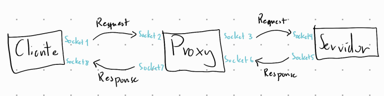

# Informe Actividad 1: Construir un Proxy
# CC4303: Redes

Profesora: Ivana Bachmann
Auxiliar: Vicente Videla
Estudiante: Javier Kauer
Fecha de entrega: 10/09/2023

## Desarrollo

Para esta actividad se siguieron los pasos tal cual descritos en eol en la sección de actividad. Por lo tanto se siguieron los pasos de la parte 1 y de la parte 2. 

### Parte 1
Para la parte 1, esta correspondía a crear una función que lea, interprete y crea mensajes HTTP. Para lograr este objetivo se crea 2 funciones, la primera que toma la información del mensaje HTTP en bytes y lo separa en un lista con el HEAD, y el BODY. En la primera parte se tiene un diccionario con todos lo headers correspondiente y sus valores, y el segundo corresponde al BODY almacenado en texto plano. Después la segunda funcion recibe la estructura de datos mencionada anteriormente y retorna un mensjae HTTP codifica en bytes. Para hacer esto toma las keys de los diccionarios y sus valores y los agrega en un mensaje de texto plano, y finalmente se le agrega el body, para terminar convierte este mensaje a uno 
codificado en bytes. 

A continuación se presenta el código de estas 2 funciones:

``` python
# Funcion que decodifica y guarda el mensaje en una lista [head, body]
def parse_HTTP_message(http_message):
    http_message = http_message.decode()
    decoded_http_message = http_message.split("\r\n\r\n", 1)

    head = decoded_http_message[0]
    body = decoded_http_message[1]

    headers = head.split("\r\n")
    headers_dict = {}
    for i in range(len(headers)):
        if i == 0:
            headers_dict["first_line"] = headers[i]
        else:
            header = headers[i].split(": ", 1)
            headers_dict[header[0]] = header[1]
            
    parse_HTTP = [ headers_dict, body]

    return  parse_HTTP
```

``` python
# Funcion que recibe la lista [head, body] y retorna un mensaje codificado
def create_HTTP_message(parse_HTTP):   
    headers_dict = parse_HTTP[0] 
    body = parse_HTTP[1]
    
    headers = ""
    for key in headers_dict.keys():
        if key == "first_line":
            headers += headers_dict[key] + "\r\n"
        else:
            headers += key + ": " + headers_dict[key] + "\r\n"
    
    http_message = headers + "\r\n" + body

    return http_message.encode()
```

Para terminar la parte 1, se modifica el servidor para que este pueda agregar un header al mensaje HTTP, este siendo *X-ElQuePregunta*, y su contenido siendo mí nombre. Esto se hace abriendo el archivo json necesario para la actividad y rescatando el nombre de este que se agrega anteriormente.

``` python
response_head += "X-ElQuePregunta: "
with open((location_json + "/" + name_json) + ".json") as file:
    # usamos json para manejar los datos
    data = json.load(file)
    name_header = data["user"] 

response_head += name_header + "\r\n\r\n"
```

Tal como se puede observar también se termina agregando la habilidad del código para que reciba un input con el nombre del archivo .json, y su ubicación. Esto se puede observar a continuación.

``` python
name_json = input("Ingrese nombre del archivo json: ")
location_json = input("Ingrese ubicación archivo json: ")
```

### Parte 2

Con respecto a la parte 2, esta se enfocaba en crear el proxy, y utilizarlo para varias funcionalidades.

Lo primero que se hizo corresponde a modificar el código anterior para que se comporte como un proxy entre el cliente y el servido de destino que se quiere usar. Para lograr esto se ideó un diagrama en donde se muestra cómo se usarán los sockets y como se comunican entre ellos. Este diagrama se encuentra a continuación.



Luego de idear este diagrama, se procede a hacer la implementacion en el código. Para esto se presentara los códigos que ayudan a crear esta funcionalidad.

``` python
# con la siguiente línea creamos un socket orientado a conexión
proxy_client_socket = socket.socket(socket.AF_INET, socket.SOCK_STREAM)

# parseando el mensaje y rescatando la direccion de destino
parsed_message = parse_HTTP_message(recv_message)
proxy_client_address = (parsed_message[0]["Host"], 80)

# conectandose al servidor desde el proxy
proxy_client_socket.connect(proxy_client_address)

# Se manda el mensaje al servidor
proxy_client_socket.send(proxy_message)

# Finalmente esperamos una respuesta del servidor
# Para ello debemos definir el tamaño del buffer de recepción
buffer_size = 50000
message_server = proxy_client_socket.recv(buffer_size)

new_socket.send(send_message_client)

# cerramos la conexión con el servidor
proxy_client_socket.close()    
```

Con respecto a las nuevas lineas de código que se agregaron. Se puede observar que, primero se crea un nuevo socket orientado a conexion que se comporta como cliente hacia el servidor de destino. Después se ocupa la función de parseo de la parte 1 para rescatar la dirección de destino del mensaje. A continuación se pide hacer conexión con el servidor, y se envía el mensaje al servidor. Después se recibe el mensaje dentro del proxy, y se envía al cliente. Finalmente se cierra el socket para no recibir mas información.

La siguiente parte corresponde a crear un *firewall* o un *control parental* de tal forma que no se permita acceder a ciertas páginas webs. Para lograr esto se creo una funcion auxiliar llamada *check_blocked_sites(primera linea de un mensaje HTTP, ubicación archivo json, nombre archivo json)*, la cual obtiene la página web que el cliente quiere acceder, después compara con todos las páginas bloqueadas en el archivo json, y si se encuentra uno retorna 1, y si no retorna 0. Finalmente, si se retorna 0, entonces se mande un mensaje con el error HTTP 403 y un mensaje al cliente, se cierra la conexión con el socket y se termina el código. Todo lo programado en esta sección se encuentra a continuación, lo cual incluye la función mencionada anteriormente y el código que se agregó al código principal.

``` python
# función auxiliar de chequeo de paginas webs
def check_blocked_sites(first_line, location_json, name_json):
    with open((location_json + "/" + name_json + ".json")) as file:
        # usamos json para manejar los datos
        data = json.load(file)

        pattern = r'GET (https?://[^\s]+) HTTP/1.1'
        requested_site = re.search(pattern, first_line)

        for i in data["blocked"]:
            if i == requested_site.group(1):
                return 1
        else:
            return 0

# código nuevo principal
is_forbidden = check_blocked_sites(parsed_message[0]["first_line"], location_json, name_json)
if is_forbidden:
    new_socket.send(forbidden_message.encode())
    
    new_socket.close()
    break
```

Después, se sigue con el caso en donde no se quiera acceder a un página web no permitida. En este caso simplemente se agrega un nuevo header al HEAD del mensaje HTTP. Para poder lograr esto se ocupan las funciones de la primera parte, en donde se transforma a la estructura de datos, se módifica directamente después y finalmente se crea el mensaje HTTP. A continuación se incluye el código que hace este funcionamiento.

``` python
parsed_message[0].update({"X-ElQuePregunta: ": name_header})
parsed_message = [parsed_message[0], parsed_message[1]]

proxy_client_address = (parsed_message[0]["Host"], 80)
```

Continuando con la activdad, la siguiente parte corresponde a reemplazar contenido inadecuado que se encuentra en una página web. Esto se logra creando una función auxiliar llamada *replace_forbidden_words(mensaje HTTP, ubicación archivo json, nombre archivo json)*. Esta ocupa los diccionarios que se encuentran en el json, y si encuentra una llave en el texto del BODY, entonces los reemplaza con la palabra asociada. Además se agrega una funcionalidad para actualizar el valor del header Content-Length para que se transmite el mensaje completo. El código de esta función y las nuevas lineas de código en el programa principal se encuentran a continuación.

```python
def replace_forbidden_words(http_message, location_json, name_json):
    with open((location_json + "/" + name_json + ".json")) as file:
        # usamos json para manejar los datos
        data = json.load(file)
        forbidden_words = data["forbidden_words"]
        new_body = http_message[1]

        # remplazar las palabras prohibidas
        for i in forbidden_words:
            for key, value in i.items():
                new_body = new_body.replace(key, value)

        # actualizar el tamaño de content-length
        new_bytes_size = len(new_body.encode('utf-8'))
        http_message[0]["Content-Length"] = str(new_bytes_size)

        return [http_message[0], new_body]

# modificar el mensaje para remplazar contenido inadecuado
recieved_message_server = parse_HTTP_message(message_server)

modified_message_server = replace_forbidden_words(recieved_message_server, location_json, name_json)

send_message_client = create_HTTP_message(modified_message_server)
```

Finalmente, para terminar la actividad se plantea el problema de usar un buffer menor que el tamaño del mensaje HTTP. Para lograr esto primero se respondieron las siguiente preguntas: ¿Cómo sé si llegó el mensaje completo? ¿Qué pasa si los headers no caben en mi buffer? ¿Cómo sé que el HEAD llegó completo?¿Y el BODY?. Las respuestas para estas preguntas son las siguiente. La primera corresponde a que se asegura llegar al momento del mensaje que se obtiene *\r\n\r\n* para el HEAD, y en el vaso del BODY se va obteniendo tantos bytes hasta obtener la cantidad que se encuentra en el *Content-Length* del HEAD. La segunda corresponde a que se obtiene mensajes en un loop hasta haber recibido todo el HEAD, y ahi recien se analizan los headers para obtener información adicional del mensaje. La tercera y cuarta corresponden a las respuestas de la primera pregunta, es decir con *\r\n\r\n* para el HEAD y el *Content-Length* del HEAD para el BODY. Toda esta implemenetación se encuentra a continuación.

```python
def receive_full_message(connection_socket, buff_size):
    full_message = b''
    headers_received = False
    content_length = 0
    header_end_sequence = b'\r\n\r\n'

    while True:
        recv_message = connection_socket.recv(buff_size)
        full_message += recv_message

        if not headers_received:
            # Busca el final de los headers
            header_end_index = full_message.find(header_end_sequence)
            if header_end_index != -1:
                headers_received = True

                # Obtiene los headers
                headers = full_message[:header_end_index + len(header_end_sequence)].decode()

                # Busca Content-Length en los headers
                content_length_match = re.search(r'Content-Length: (\d+)', headers)
                if content_length_match:
                    content_length = int(content_length_match.group(1))

        if headers_received:
            # Verifica si se ha recibido todo el cuerpo del mensaje
            body_start_index = header_end_index + len(header_end_sequence)
            if len(full_message) - body_start_index >= content_length:
                break

    return full_message

# version modificada para recibir mensaje del cliente con buffer chico
recv_message = receive_full_message(new_socket, buff_size)
```

## Resutados obtenidos

Antes de correr los test de por si, se verifica que se puede acceder a los siguiente sitios webs: *http://cc4303.bachmann.cl/*, *http://cc4303.bachmann.cl/replace*, y *http://cc4303.bachmann.cl/secret*, y se nota el contenido obtenido de las paginas webs para después compararlo.

Ahora para hacer test de lo que se programó, se decidió usar Mozilla Firefox como cliente que ocupa como proxy la dirección *localhost:8000* como intermediaro entre la página web de destino.

El primer test corresponde a acceder a la página web *http://cc4303.bachmann.cl/secret* después de correr el código. El resultado obtenido corresponde a que no se puede ver este sitio como antes y se recibe un error 403.

El segundo test corresponde acceder al sitio *http://cc4303.bachmann.cl/* después de correr el código. Se observa que la pagina web se encuentra módificada con la vez anterior.

El tercer test corresponde a que se accede al sitio *http://cc4303.bachmann.cl/* y *http://cc4303.bachmann.cl/replace*. Se observa que las palabras prohibidas se encuentran reemplazadas en la segunda página al usar el proxy.

El cuarto test corresponde a ocupar 2 subtest en donde se accede a la página web *http://cc4303.bachmann.cl/*. El primero correspode a elegir un tamaño de buffer mayor que el HEAD, pero menor que el mensaje HTTP completo, el tamaño elegido corresponde a 140 bytes, el cual cumple con las condiciones. Además se observa que la página web se encuentra igual que en los test anteriores. El segundo corresponde a elegir un un tamaño mayor que el first line y menor que el HEAD, el tamaño elegido corresponde a 136 bytes, el cual cumple con las condiciones. Además se observa que la página web se encuentra igual que en los test anteriores.

