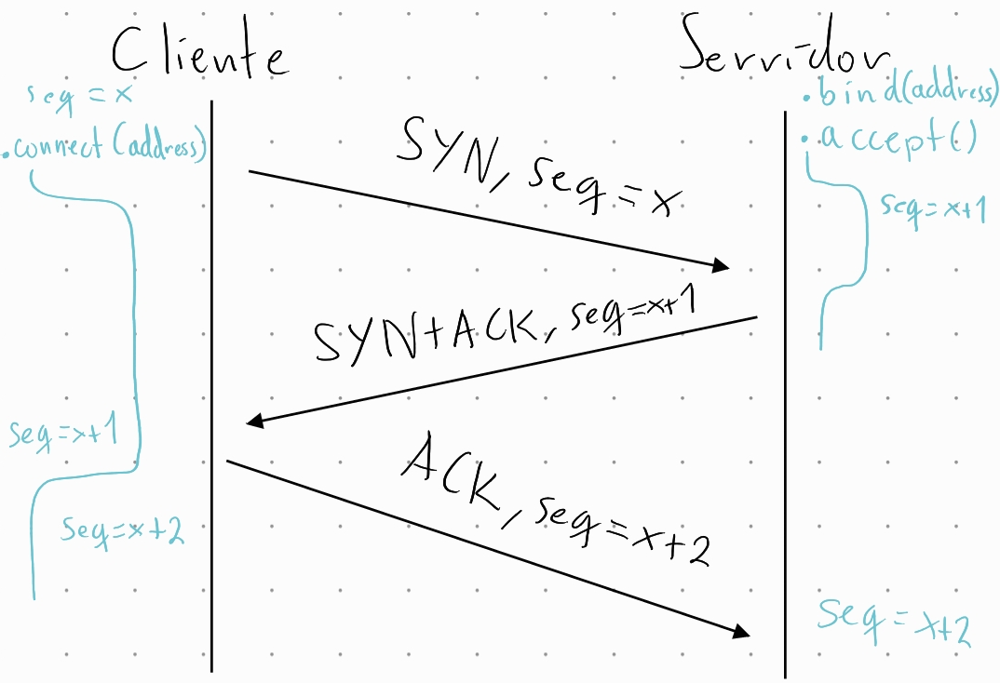
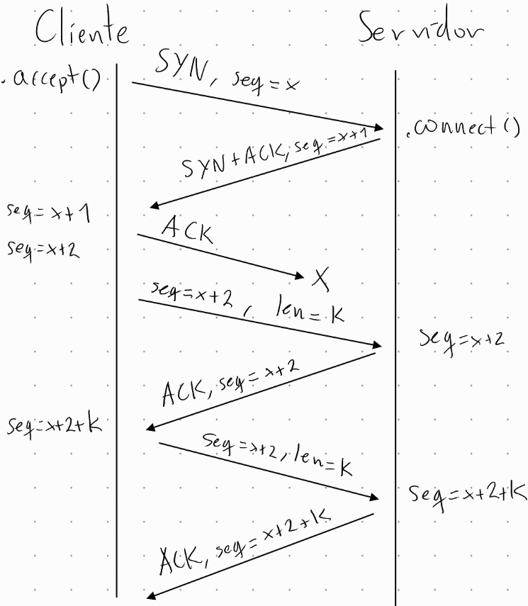

# Informe Actividad 3: Construir un Proxy
# CC4303: Redes

Profesora: Ivana Bachmann
Auxiliar: Vicente Videla
Estudiante: Javier Kauer
Fecha de entrega: 10/09/2023

## Desarrollo

Para esta actividad se siguieron los pasos tal cual descrito en la sección de la actividad. 

Además se utilizaron las siguiente librerías. Sockets, sys, random, y la clase SocketUDP para simular perdidas a mano.


### Paso 1
Para el paso 1, se creó un servidor y cliente, los cuales se comunican ocupando un socket no orientad a conexión. Como el cliente tiene que leer un archivo desde la entrada estandard, esto se logra usando el simbolo de < seguido del archivo de texto. Siguiendo la consola esto se hace de la siguiente forma:

``` console
$ python3 client1.py localhost 8000 < "text.txt"
```

Además para abrir este archivo, python lo hace linea por linea, y toma el mensaje entero en texto plano. El código en python es el sigiuente:

``` python
message = ""
while True:
    try:
        line = input()
        message += line + '\n'
    except EOFError:
        break
```


En este paso, es importante la implementación que hace que se manden mensaje de tamaño máximo de 16 bytes. Esto se hace usando el siguiente código de python:

``` python
# byte_inicial indica desde donde comenzamos a mandar el mensaje
byte_inicial = 0

message = message.encode()

# en message_sent_so_far vamos a guardar el mensaje completo que se ha enviado hasta el momento
message_sent_so_far = ''.encode()

# dentro del ciclo cortamos el mensaje en trozos de tamaño 16
while True:
    # max_byte indica "hasta que byte" vamos a enviar, lo seteamos para evitar tratar de mandar más de lo que es posible
    max_byte = min(len(message), byte_inicial + 16)

    # obtenemos el trozo de mensaje
    message_slice = message[byte_inicial: max_byte]

    # Se decodifica el mensaje para agregarle el head tcp y despues de codifica devuelta
    message_tcp = b"0|||0|||0|||" + message_slice

    # mandamos el mensaje
    client_socket.sendto(message_tcp, server_address)

    # actualizamos cuánto hemos mandado
    message_sent_so_far += message_slice

    if (message_sent_so_far == message):
        break

    # de lo contrario actualizamos el byte inicial para enviar el siguiente trozo
    byte_inicial += 16

    if (byte_inicial > len(message)):
        byte_inicial -= (byte_inicial-len(message))
```

### Paso 2

El paso 2 corresponde a la creación de una clase SocketTCP. La cual se crea en un archivo separado y que después se importa directamente en los archivos de cliente y servidor.

El objetivo de este paso es la creación de la clase, y también la del constructur que almacene todos los valores importantes. El asociado a este paso se muestra a continuación.

``` python
class SocketTCP():

    def __init__(self):
        # Creando un socket no orientado a conexión
        # self.socket = socket.socket(socket.AF_INET, socket.SOCK_DGRAM)
        self.socket = SocketUDP()
        self.socket.send_loss_rate = 0.2 # configurable
        self.destinity_address = None
        self.origin_destiny = None
        self.sequence = None
        self.rest = 0
        self.message_length = None
        self.cache = None
```

Tal como se puede ver, en el contructor se crean los valores necesario para el comportamiento de la clase SocketTCP. Esto se logra guardando: el socket udp que se utiliza para la comunicación, el loss rate de los mensaje enviados, la dirección de destino, la dirección de origen, la secuencia de los mensaje tcp, la cantidad restante de valores a recibir, el largo del mensaje a recibir, y un cache con los valores que todavía no se devuelven.

### Paso 3

Con respecto a este paso, este se centra en la creación de 2 métodos de la clase creada en el paso anterior. Estos métodos corresponden a parse_segment(tcp_message) y create_segment(parsed_tcp_message). Esta funciones hacen que sea más fácil la lectura, modificación y envió de mensajes tcp. 

El método parse_segmente(tcp_message) corresponde al siguiente código:

``` python
def parse_segment(self, tcp_segment):
    """ convierte un mensaje tcp con headers a un diccionario de:
        diccionario: head: {SYN: ,ACK: ,FIN: , seq: }, body: 

        tcp segment tiene el siguiente formato
            headers(0 o 1) ||| mensaje (string)
        SYN|||ACK|||FIN|||seq|||msg
    """

    tcp_dictionary = {}
    head, body = tcp_segment.rsplit(sep= "|||", maxsplit= 1)
    
    headers = head.split(sep= "|||", maxsplit= 3)
    headers = [int(x) for x in headers]
    
    headers_dictionary = {}
    for i in range(len(headers)):
        if i == 0:
            headers_dictionary.update({"SYN": headers[i]})
        if i == 1:
            headers_dictionary.update({"ACK": headers[i]})
        if i == 2:
            headers_dictionary.update({"FIN": headers[i]})
        if i == 3:
            headers_dictionary.update({"seq": headers[i]})
    
    tcp_dictionary.update({"headers": headers_dictionary})
    tcp_dictionary.update({"body": body})
    return tcp_dictionary
```

Tal como se puede observar, este método convierte un mensaje tcp en un diccionario con dos contenidos. El primero corresponde a un también un diccionario que contiene los headers del HEAD (SYN, ACK, FIN, sequence), y el segundo corresponde a el contenido del BODY en el mensaje TCP. Además es importante agregar que estos valores se guardan como número y como string respectivamente.

El método create_segment(parsed_tcp_message) corresponde al siguiente código:

``` python

def create_segment(self, parsed_tcp_message):
    """ convierte un diccionario de: diccionario: head: {SYN: ,ACK: ,FIN: , seq: }, body: 
        a un mensaje de este formato
        
        tcp segment tiene el siguiente formato
            headers(0 o 1) ||| mensaje (string)
        SYN|||ACK|||FIN|||seq|||msg
    """
    tcp_segment = ""
    for tcp_message, message in parsed_tcp_message.items():
        if tcp_message == "headers":
            for _, headers in message.items():
                tcp_segment += str(headers) + "|||"
        else:
            tcp_segment += message

    return tcp_segment
```

Tal como se puede observar, este método obtiene los valores de la estructura de datos definida anteriormente, y arma un mensaje tcp con los valores adecuados. Importante notar que para separa los distintos contenidos se ocupa 3 |, es decir |||.

### Paso 4

Este paso corresponde a la implementación del 3-Way-Handshake característico de los sockets TCP. Esta comunicación tiene que ser de 3 pasos para que la comunicación sea bidireccional. Para lograr esto, se crean 3 métodos de la clase SocketTCP, los cuales corresponden a bind(address), connect(address), accept().

Para poder mejor ejemplificar el funcionamiento de esto, se incluye un diagrama de cliente/servidor, con las invocaciones de la funciones en los pasos adecuados.



A continuación se incluye el código de connect, el cual de acuerdo con el diagrama es el que invoca el cliente para solicitar la conexión con el servidor:

``` python
def connect(self, address):
    # se inicia un numero de secuencia aleatorio
    self.sequence = random.randint(0, 100)

    while True:
        try:
            self.socket.settimeout(5)
            # se crea el mensaje de sincronizacion y se manda
            message = b"1|||0|||0|||" + str(self.sequence).encode() + b"|||"
            self.socket.sendto(message, address)

            # se recibe el mensaje de confirmacion y se verifica este
            # finalmente se manda un mensaje de confirmacion devuelta
            message, destinity_address = self.socket.recvfrom(udp_buff_size)

            parsed_message = self.parse_segment(message.decode())
            parsed_headers = parsed_message["headers"]

            if parsed_headers["SYN"]:
                if parsed_headers["ACK"]:
                    if parsed_headers["seq"] == self.sequence + 1:
                        message = "0|||1|||0|||" + str(self.sequence + 2) + "|||"
                        self.sequence += 2
                        self.destinity_address = destinity_address
                        self.socket.sendto(message.encode(), address)
                        return                    
        except socket.timeout:
            continue
```


La función connect(address) corresponde a la generación aleatoria de un número de secuencia, el cual después se agrega como header para enviar al servidor en el mensaje de solicitud de conexión. Después, se invoca recvfrom para recibir la respuesta del servidor con respecto a la solicitud de conexión de este. Finalmente, se verifica que el mensaje de respuesta contiene los headers (SYN, ACK y número de secuencia) correctos tal cual como el diagrama, y si es asi, entonces se enviá un mensaje de confirmación (ACK) al servidor con el número de secuencia adecuado.

A continuación se incluye el código de bind y accept, tal cual como muestra el diagrama.

``` python
def bind(self, address):
    # tener ojo con los address

    self.socket.bind(address)

def accept(self):
    
    while True:
        # se recibe el mensaje de confirmacion
        message, client_address = self.socket.recvfrom(udp_buff_size)
        parsed_syn_message = self.parse_segment(message.decode())
        self.destinity_address = client_address

        new_socket = SocketTCP()
        new_udp_socket = new_socket.socket
        new_client_address = (client_address[0], int(client_address[1]) + 1)
        new_socket.bind(new_client_address)
        new_socket.destinity_address = client_address
        

        # se verifica que el mensaje sea uno de sincronizacion
        if parsed_syn_message["headers"]["SYN"] == 1:
            parsed_syn_message["headers"]["ACK"] = 1
            self.sequence = parsed_syn_message["headers"]["seq"] + 1
            parsed_syn_message["headers"]["seq"] += 1
            send_message = self.create_segment(parsed_syn_message)
            new_udp_socket.sendto(send_message.encode(), client_address)

        # se recibe un mensaje de confirmacion, se verifica su contenido y se retorna el SocketTCP creado
        while True:
            try:
                self.socket.settimeout(8)
                ack_message, _ = self.socket.recvfrom(20)

                parsed_ack_message = self.parse_segment(ack_message.decode())
                parsed_ack_header = parsed_ack_message["headers"]

                if parsed_ack_header["ACK"]:
                    if parsed_ack_header["seq"] == self.sequence + 1:
                        self.sequence += 1
                        new_socket.sequence = self.sequence
                        self.destinity_address = client_address
                        self.socket.settimeout(0)
                        return (new_socket,  self.destinity_address)
                    
                else:
                    continue

            except socket.timeout:
                break
```

El método bind corresponde a la llamada de bind con el address correcto del socket udp utilizado por la clase SocketTCP.

Finalmente, se tiene el método connect, el cual corresponde al método que invoca el servidor para aceptar la solicitud de conexión del cliente. Por lo tanto este comienza recibiendo un mensaje, y si este corresponde a un mensaje de SYN, se crea una instancia de la clase SocketTCP, se crea una dirección, y se hace bind al socket udp interno de esta clase. Después se verifica que el mensaje recibido corresponde a un mensaje de solicitud de conexión tal cual como se muestra en el diagrama, y si lo es, se módifica guarda el número de secuencia y recien entonces se envia una respuesta al cliente con los headers indicados (SYN, ACK, y número de secuencia correcto). Finalmente, se recibe el mensaje de confirmación del cliente, y se actualiza el número de secuencia recibido. 

### Paso 5

En el paso 5, se implementa timeouts de los sockets internos utilizando el método settimeouts propio de los sockets udp. Además, se implementa los metodos send(message), y recv(buff_size) en la clase SocketTCP. 

Como se está utilizando timeouts también se tiene que manejar errores, los cuales se manejan con un bloque try-except, y el error socket.timeout.

Antes de introducir el código de por si es necesario explicar el funcionamiento general de estos metodos. 

Para send, este se ocupa como base el código creado en la parte 1, el cual se centra en mandar mensaje con headers tcp, y un BODY de máximo de 16 bytes. Además se le tiene que agregar el timeout dicho anteriormente. Además, para facilitar el correcto funcionamiento entre los sockest tcp, el primer mensaje que envia corresponde al largo del mensaje que se quiere enviar. De esta forma facilitando al servidor saber cuantos bytes tiene que esperar. Finalmente, para cada mensaje que se enviá, se espera un mensaje de confirmación (ACK), desde el servidor.

El código de este método es el siguiente:

```python
def send(self, message):
    # primer mensaje que se envia corresponde al largo del mensaje
    message_length = len(message)

    message_length_to_send = b"0|||0|||0|||" + (str(self.sequence)).encode() + b"|||" + (str(message_length)).encode()

    while True:
        try:
            self.socket.settimeout(5)
            self.socket.sendto(message_length_to_send, self.destinity_address)
            
            confirmation_message, _ = self.socket.recvfrom(udp_buff_size)
            parsed_confirmation_message = self.parse_segment(confirmation_message.decode())

            if ((parsed_confirmation_message["headers"]["ACK"] == 1) and (parsed_confirmation_message["headers"]["seq"] >= self.sequence + len(str(message_length)))):
                self.sequence += len(str(message_length))
                break

        except socket.timeout:
            continue

    # byte_inicial indica desde donde comenzamos a mandar el mensaje
    byte_inicial = 0

    # en message_sent_so_far vamos a guardar el mensaje completo que se ha enviado hasta el momento
    message_sent_so_far = ''.encode()

    # dentro del ciclo cortamos el mensaje en trozos de tamaño 16
    while True:
        try:
            self.socket.settimeout(5)
            
            # max_byte indica "hasta que byte" vamos a enviar, lo seteamos para evitar tratar de mandar más de lo que es posible
            max_byte = min(len(message), byte_inicial + 16)

            # obtenemos el trozo de mensaje
            message_slice = message[byte_inicial: max_byte]

            # Se decodifica el mensaje para agregarle el head tcp y despues de codifica devuelta
            message_tcp = b"0|||0|||0|||" + (str(self.sequence)).encode() + b"|||" + message_slice

            # mandamos el mensaje
            self.socket.sendto(message_tcp, self.destinity_address)

            # se recibe el mensaje
            recieved_message, _ = self.socket.recvfrom(udp_buff_size)
            parsed_recieved_message = self.parse_segment(recieved_message.decode())

            
            # se verifica que el mensaje corresponde al correcto
            if parsed_recieved_message["headers"]["ACK"] == 1:
                if parsed_recieved_message["headers"]["seq"] >= self.sequence + (max_byte - byte_inicial):
                    # actualizamos cuánto hemos mandado
                    message_sent_so_far += message_slice
                    self.sequence += len(message_slice)

                    # si se manda y se recibe todo el mensaje se termina el mensaje
                    if (message_sent_so_far == message):
                        
                        break

                    # de lo contrario actualizamos el byte inicial para enviar el siguiente trozo
                    byte_inicial += 16

                    if (byte_inicial > len(message)):
                        byte_inicial -= (byte_inicial-len(message))
        
        except socket.timeout:
            continue
```

Tal como se puede observar, estos tienen los conceptos indicados anteriormente, es decir se incluye un  el envio de un mensaje con su largo, un timeout para su respuetsa, y la verificaión de este, y finalmente, el envio del mensajes en trozos de 16 bytes, un timeout para su respuesta, y la verificación de este. Además, se puede observar que a medida que se envian los datos, estos actualiza el valor del número de secuencia almacenado por el cliente. Finalmente, se puede observar el el manejo de los errores que se pueden producir por el timeout.

Continuando, para recv, al igual, se incluye una descripción del funcionamiento de este método. Es decir, en primera instancia se recibe el largo del contenido del mensaje a recibir por el cliente, y se manda un mensaje de confirmación devuelta. Después se empieza a recibir el mensaje y se verifica los casos. Es decir existen 2 casos, el primero donde todo el mensaje cabe dentro de buff_size, entonces se hace solamente un return, después el caso en donde el mensaje no cabe dentro del buff_size, y existen 2 subcasos. El primero en donde es la primera vez que se llama este caso, en donde se recibe el mensaje completo, se hacen las actualizaciones necesarias, almacena en un cache la parte del mensaje que no se usa, y se retorna la cantidad de buff_size de bytes del mensaje. Y la segunda vez que se llama, en donde se recibe el mensaje, se agrega al cache, y se retorna la cantidad buff_size de bytes del cache (esto se hace de forma iterativa, entonces siempre retornaría hasta acabarse el cache, o ya no se envían mas mensajes). Finalmente, es importante comentar que para cada mensaje que se recibe, se manda al cliente un mensaje de confirmación con el número de secuencia adecuado.

El código de este método se muestra a continuación:

``` python
def recv(self, buff_size):

    messages = ""
    # primer mensaje que recibe corresponde al largo del mensaje
    if self.rest == 0:
        while True:
            try:
                self.socket.settimeout(15)

                if self.message_length == self.rest:
                    break

                recieved_message_length, address = self.socket.recvfrom(udp_buff_size)
                parsed_message_length = self.parse_segment(recieved_message_length.decode())
                
                try:
                    self.message_length = int(parsed_message_length["body"])
                except ValueError:
                    confirmation_message = b"0|||1|||0|||" + (str(self.sequence)).encode() + b"|||"
                    self.socket.sendto(confirmation_message, self.destinity_address)
                    continue
                
                self.sequence += 2 
                self.rest = self.message_length

                confirmation_message = b"0|||1|||0|||" + (str(self.sequence)).encode() + b"|||"
                self.socket.sendto(confirmation_message, self.destinity_address)

            except socket.timeout:
                continue

    # corresponde al caso en donde ya se recibio el largo del mensaje y se sabe cuanto deberia recibir 
    # caso donde todo el mensaje cabe en el buff_size
    if self.message_length <= buff_size:
        while True:
            try:
                while self.rest > 0:
                    try:


                        self.socket.settimeout(4)
                        message, address = self.socket.recvfrom(udp_buff_size)
                        parsed_message = self.parse_segment(message.decode())

                        if parsed_message["headers"]["seq"] == self.sequence - 2:
                            confirmation_message = b"0|||1|||0|||" + (str(self.sequence)).encode() + b"|||"
                            self.socket.sendto(confirmation_message, self.destinity_address)
                            continue

                        self.sequence += len(parsed_message["body"])
                        messages += parsed_message["body"]
                        confirmation_message = b"0|||1|||0|||" + (str(self.sequence)).encode() + b"|||"
                        self.rest -= len(parsed_message["body"])
                        self.socket.sendto(confirmation_message, self.destinity_address)
                    except socket.timeout:
                        continue
                return messages.encode()
            
            except socket.timeout:
                continue
    
    # caso donde todo el mensaje no cabe en el buff_size
    else:
        while True:
            try:
                # si el mensaje se corta porque el buff_size es muy chico entonces se tiene que llamar mas veces recv
                """ if buff_size < 16: """
                message, address = self.socket.recvfrom(udp_buff_size)
                parsed_message = self.parse_segment(message.decode())

                if parsed_message["headers"]["seq"] == self.sequence - 2:
                    confirmation_message = b"0|||1|||0|||" + (str(self.sequence)).encode() + b"|||"
                    self.socket.sendto(confirmation_message, self.destinity_address)
                    continue

                # segunda llamada que se hace, se recibe mensaje directamente desde el body
                if self.rest < self.message_length:
                    # caso en que ya se tiene guardado los valores
                    if self.cache != "":
                        temp = self.cache + parsed_message["body"]
                        self.cache = temp[buff_size:]
                        self.sequence += len(parsed_message["body"])
                        confirmation_message = b"0|||1|||0|||" + (str(self.sequence)).encode() + b"|||"
                        self.socket.sendto(confirmation_message, self.destinity_address)
                        return temp[0:buff_size].encode()
                        
                # primera llamada que se hace
                else:
                    self.cache = parsed_message["body"][buff_size:]
                    self.sequence += len(parsed_message["body"])
                    messages = parsed_message["body"][0:buff_size]
                    self.rest -= len(messages)
                    confirmation_message = b"0|||1|||0|||" + (str(self.sequence)).encode() + b"|||"
                    self.socket.sendto(confirmation_message, self.destinity_address)
                    return messages.encode()
                
            except socket.timeout:
                continue
```

### Parte 6

Para este parte, se implementa el fin de conexión entre el cliente y el servidor. Para esto, se implementa 2 metodos close, y recv_close. El primero corresponde al que quiere cerrar la conexión, y el segundo corresponde al que recibe la solicitud de cierre de conexión. De esta forma el cliente y el servidor tiene que invocar el método contrario al que se invoca en el otro lado.

El código de estos metodos corresponde se incluey a continuación:

``` python
def close(self):
    # creacion mensaje de cierrte
    close_message = b"0|||0|||1|||" + (str(self.sequence)).encode() + b"|||"

    tries = 3

    while tries > 0:
        try:
            # creacion de timeout
            self.socket.settimeout(5)

            # envio mensaje de cierre
            self.socket.sendto(close_message, self.destinity_address)

            # se recibe mensaje de confirmacion de cierre
            close_confirmation_message, addesss = self.socket.recvfrom(udp_buff_size)
            parsed_close_confirmation_message = self.parse_segment(close_confirmation_message.decode())

            # se chequea si este mensaje es el correcot
            if parsed_close_confirmation_message["headers"]["FIN"] == 1:
                if parsed_close_confirmation_message["headers"]["ACK"] == 1:
                    if parsed_close_confirmation_message["headers"]["seq"] == self.sequence + 1:
                        self.sequence += 2
                        confirmation_message = b"0|||0|||1|||" + (str(self.sequence)).encode() + b"|||"
                        internal_tries = 3

                        while internal_tries > 0:
                            try:
                                self.socket.settimeout(5)
                                self.socket.sendto(confirmation_message, addesss)
                                internal_tries -= 1

                            except socket.timeout:
                                internal_tries -= 1
                                continue
                        break
                        

        except socket.timeout:
            tries -= 1
            continue

    self.socket.close()

def recv_close(self):
    tries = 3

    while tries > 0:
        try:
            self.socket.settimeout(5)
            # se recibe el mensaje de cierre
            close_confirmation_message, address = self.socket.recvfrom(udp_buff_size)
            parsed_close_confirmation_message = self.parse_segment(close_confirmation_message.decode())

            # se verifica si corresponde a un mensaje de cierre y 
            # si lo es se manda el mensaje de confirmacion y se cierra el socket
            if parsed_close_confirmation_message["headers"]["FIN"] == 1:
                parsed_close_confirmation_message["headers"]["ACK"] = 1
                parsed_close_confirmation_message["headers"]["seq"] += 1
                
                send_confirmation_message = self.create_segment(parsed_close_confirmation_message)
                self.sequence += 1
                
                self.socket.sendto(send_confirmation_message.encode(), address)
                tries -= 1
                # se recibe el mensaje de cierre
                close_confirmation_message, address = self.socket.recvfrom(udp_buff_size)
                parsed_close_confirmation_message = self.parse_segment(close_confirmation_message.decode())

                if parsed_close_confirmation_message["headers"]["seq"] == self.sequence + 1:
                    self.sequence += 1
                    break
            else:
                    self.sequence += len(parsed_close_confirmation_message["body"])
                    confirmation_message = b"0|||1|||0|||" + (str(self.sequence)).encode() + b"|||"
                    self.socket.sendto(confirmation_message, address)
        
        except socket.timeout:
            tries -= 1
            continue

    self.socket.close()
```

Tal como se puede observar anteriormente, para close, se hacen los siguiente pasos. Primero se genera una mensaje de termino de comunicación (FIN), y el número de seucuencia usado por última vez. Después recibe un mensaje de confirmación de cierre de conexión, y se verifica que contiene los headers adecuados (ACK, SYN y número de secuencia adecuado), y si es así, entonce se invoca la función close del socket udp.

Para el método recv_close, este se comporta de forma muy similar a como se está implementando cuando se reciben mensajes. Es decir, comienza esperando un mensaje, y si este corresponde a un mensaje de termino de conexión (FIN), guarda el número de secuencia, y manda devuelta un mensaje de confirmación de conexión con los headers adecuados (ACK, FIN y número de secuencia adecuado), y si se recibe un mensaje de confirmación devuelta, entonces se cierra la conexión del socket udp con close.

### Manejo de Perdidas

Para finalizar, la parte 7 y 8 corresponden al manejo de pérdidas durante la comunicación. Es decir estos pueden producirse en cualquier momento de los métodos implementados anteriormente. Estos pueden suceder en la etapa de conexión, en el envió de mensajes, o el término de comunicación.

Durante este proceso, puede existir muchos casos bordes que hechan a perder la comunicación bidireccional entre los dos sockets tcp. El caso borde simple de arreglar corresponde a cuando no se recibe un mensaje dentro de una etapa. Para solucionar esto, simplemente se ocupa el timer, y si no se recibió un mensaje en cierto tiempo, entonces simplemente se asume que el mensaje no llego y se tiene que volver a enviar. En el otro sentido, si no llega un mensaje después de cierto tiempo se vuelve a recibir mensaje. Estas soluciones se pueden observar en los códigos anteriores cuando se ocupa un ciclo while True, con un try y except que hace un continue, haciendo que llegue al incio de ese ciclo (el cual puede ser send o recvfrom).

Para resolver el segundo caso, este es más complicado pues el emisor piensa que esta en una etapa distinta al que cree que esta el receptor. Por lo tanto para solucionar este problema, se adjunta una imagen que logra ilustrar como se resolvió.



Tal como se puede observar en esta imagen, se expone el caso en la etapa de conexión del cliente con el servidor. Este proceso comienza como esperado, con el cliente enviando una solicitud de conexión, y el servidor enviado un mensaje de confirmación de conexión. Pero, después de que el cliente envie el mensaje de confirmación, este se pierde, causando que el cliente piense que esta en la etapa de envio de mensaje, y el servidor en la etapa de conexión. Por lo tanto el cliente envia el mensaje de largo de contenido del mensaje a enviar, y el servidor se da cuenta de esto, y envia un mensaje de confirmación, pero con el número de secuencia no cambiado, y entonces el servidor se da cuenta que el cliente ahora esta en la etapa de conexión y el próximo mensaje que debería recibir corresponde al primer mensaje de la etapa de envió de mensajes. Por lo tanto, el cliente nuevamente enviá el mensaje enviado anteriormente y como el servidor ya sabe que esta en la etapa de envio de mensaje, recibe el mensaje y devuelve un mensaje de confirmación con el número de secuencia cambiado, y se puede continuar cominicando con los casos borde de la primera situación.

La razón por la cual se puede ocupar esta solución, es porque el cliente corresponde al que más afecta que cambie de etapa y por lo tanto el servidor solamente tiene que estar a la par con el cliente. Por lo tanto esta implementación se ve en el código de recv, donde se ocupan ciertos casos para volver a enviar un mensaje de confirmación al cliente con el caso descrito anteriormente.

Además, esta forma de solucionar este problema también se aplica cuando se cambia entre las etapas de envio de mensajes, y solicitud de término de conexión. Pues, puede que el servidor pierda el último mensaje de confirmación, y el cliente piense que todavía no ha llegado el mensaje de envio y lo envie denuevo. Pero como el servidor sí le llego, entonces entra a la método de recv_close, pero como el mensaje no corresponde a un mensaje de termino de conexión, solamente envia un mensaje de confirmación del mensaje anterior para que el cliente pase a la etapa de cierre de conexión.

Finalmente, aparte de lo mencionado anteriormente, se implementa el paso 8. El cual corresponde a usar settimeout cuando se invoca los metodos de cierre de conexión. En donde se ocupan contadores internos para que se cumple el mecanismo de cierre de conexión entre los socktes, y si no es asi entonces se asume que ya se cerró la conexión.

## Resultados Obtenidos

Para testear el paso 1, se ocupa los código de python de client1.py, y server1.py. Después de ejectuar la prueba, se obtiene el archivo de texto incluido.

Para testear el paso 4, se ocupa los código de python de client4.py, y server4.py. Después de ejectuar la prueba, se obtiene que no retorna un error y se establece la conexión.

Para testear el paso 5, se ocupa los código de python de client5.py, y server5.py. Después de ejectuar la prueba, se pasán todos los tests. Es decir se testea cuando todo el buffer cabe en el mensaje enviado de 16 bytes, cuando el buffer es más grande que 16 bytes y se recibe en más de 2 envio de datos, y cuando no cabe todo el buffer, y se recibe en 2 envios llamando a recv 2 veces.

Para testear el paso 6, se ocupa los código de python de client6.py, y server6.py. Después de ejectuar la prueba, se obtiene que no retorna un error y se establece la cierra la conexión.

Para testear el paso 8, se ocupa los código de python de client8.py, y server8.py. Después de ejectuar la prueba, seleccionando un send_loss_rate de 0.2, la semilla predefinida, y el modo debug activado, se observa que se pierden mensajes, pero que estos no afectan la comunicación adecuada de los sockets tcp. Logrando que no cause problemas para la verificación.